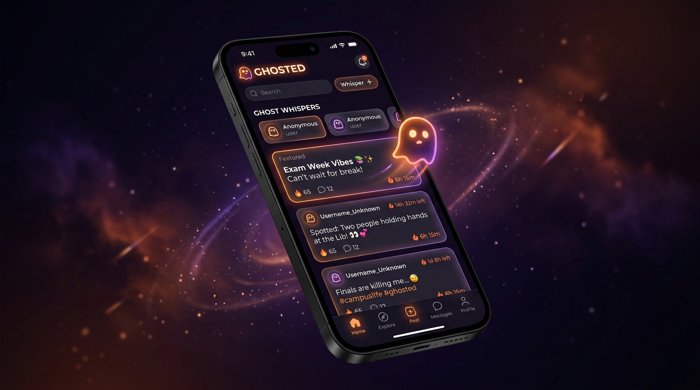
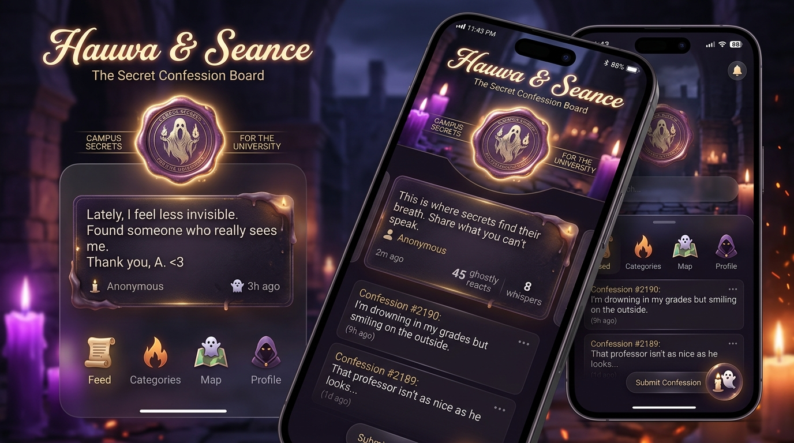
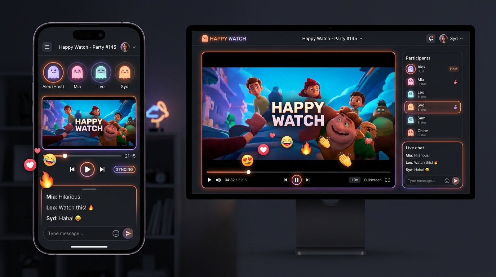
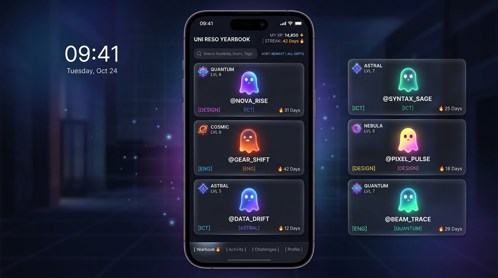

# Ghosted 👻 • Anonymous University Campus Network

> **"Where campus whispers found their true voice."**  
> An anonymous, high-fidelity social sanctuary engineered for university students to speak freely, connect without peer pressure, and experience synchronized dorm cinema.

---

### 🌐 Live Showcase & Demo Links
* **Interactive Web Simulator:** [https://rudra-singh-rajput.github.io/Ghosted_Showcase/](https://rudra-singh-rajput.github.io/Ghosted_Showcase/)
* **Official Farewell Landing Page:** [https://ghosted-2c50e.web.app](https://ghosted-2c50e.web.app)
* **Showcase Repository:** [https://github.com/Rudra-Singh-Rajput/Ghosted_Showcase](https://github.com/Rudra-Singh-Rajput/Ghosted_Showcase)

---

## 📸 Visual Showcase & Interface Matrix

  
  
<em>The Ghosted mobile interface running with glowing warm ember accents, frosted glassmorphism, and ephemeral decaying whispers.</em>

---

## 🌌 Project Vision & Background

On university campuses, fear of social judgment, peer perception, and academic stress often silence honest conversations. **Ghosted** was designed and developed by **Rudra Singh Rajput** at **Adani University** as an antidote to this friction.

Built with a sleek, mystical aesthetic (warm ember orange `#FF8700` and ethereal violet `#9D4EDD`), Ghosted offered students:
1. **Zero Real-World Identity Links:** No names, profile photos, or phone numbers.
2. **Ephemeral Lifespan:** Content automatically faded and decayed over 24 hours.
3. **Campus Domain Protection:** Access locked strictly to verified `@adaniuni.ac.in` student domains.

> [!NOTE]  
> **Production Service Concluded:** The live real-time Firebase services have officially concluded. This repository acts as the public portfolio, design system showcase, and interactive simulator.

---

## âš¡ Key Product Features

### 1. The Ghost Board (Main Void Feed)
* **Decaying Whispers:** Posts gradually blur and fade out as their 24-hour countdown expires using custom optical blur filters.
* **Echoes:** Upvote whispers into campus prominence without revealing who resonated with them.
* **Locked Secrets (The Payoff):** Students could post campus mysteries that remained encrypted until the student body cast enough votes to unlock the secret payload.

---

### 2. Séance & Hauwa (The Secret Confession Altar)

  

* **Secret Portal Entry:** Hidden on mobile devices—tapping the glowing Ghost icon on the phone opened the mystical Séance gateway.
* **Wax-Sealed Confessions:** Write deep, vulnerable, or humorous campus confessions marked with digital wax stamps.
* **Mood & Category Filters:** Browse confessions tagged by `#Crush`, `#Exams`, `#HostelLife`, or `#Faculty`.
* **Lit Candle Reactions:** Students lit candles in solidarity with anonymous classmates.

---

### 3. Happy Watch (Synchronized Dorm Cinema)

  

* **Sub-50ms Playback Sync:** Enabled campus dorms to watch YouTube videos, lectures, and music together in real-time.
* **Spectator Callout Physics:** Send floating emoji reactions (`😂`, `❤️`, `🔥`, `👻`) that animate smoothly across everyone's screens.
* **In-Room Whisper Chat:** Anonymous live chat stream alongside the video player.

---

### 4. Vapor Chat & View-Once Photos
* **Dissolving Message Bubbles:** 1-on-1 direct messaging rooms where conversations dissolve into ash after 24 hours.
* **5-Second View-Once Media:** Encrypted photo sharing with a self-destruct countdown timer, leaving zero trace in storage.
* **Group Chat Matrix:** Anonymous group channels with custom anonymous admin keys and member role badges.

---

### 5. Campus Yearbook & Resonance XP

  

* **Department Spirit Avatars:** Browse ghost avatars filtered by university department (`ICT`, `Management`, `Engineering`, `Design`).
* **Spectral Rank Ladder:** Earn Resonance XP through positive campus contributions:
  1. 👻 **Phantom** (Novice)
  2. 🔮 **Wraith** (Active Contributor)
  3. âš¡ **Nightstalker** (Campus Presence)
  4. 👑 **Void Sovereign** (Legendary Status)
* **Streak Multipliers:** Bonus resonance awarded for daily logins and positive interactions.

---

### 6. Quad-Theme Engine
Switch dynamically between 4 curated visual themes:
* 🔥 **Ghosted:** Warm Ember Orange (`#FF8700`) & Deep Dark Obsidian
* 🌌 **Cosmic:** Deep Nebula Purple (`#BD00FF`) & Cyan Plasma
* 🌿 **Aurora:** Emerald Teal (`#00FFCC`) & Midnight Ocean
* 💥 **Comic:** Graphic Novel Halftone & Retro Pop Panel

---

## 🛠️ System Architecture & Tech Stack

```mermaid
graph TD
    Client["📱 Flutter Web & Mobile Client"]
    Auth["🔐 Firebase Auth (@adaniuni.ac.in)"]
    Firestore["âš¡ Cloud Firestore (Real-time NoSQL)"]
    Cloudinary["☁️ Cloudinary CDN (WebP / Media Pipeline)"]
    TTL["⏳ 24h Auto-Purge Worker"]

    Client -->|Domain Verification| Auth
    Client -->|Live Stream Listeners| Firestore
    Client -->|WebP Encrypted Uploads| Cloudinary
    Firestore -->|Ephemeral Cleanup| TTL
```

| Component | Technology | Role |
| :--- | :--- | :--- |
| **Frontend Client** | **Flutter 3.x (Dart)** | Multi-platform responsive UI, CanvasKit rendering, 60fps animations |
| **Realtime Database** | **Cloud Firestore** | Reactive NoSQL document streams, security rules, presence tracking |
| **Authentication** | **Firebase Auth** | Domain-restricted verification (`@adaniuni.ac.in`) |
| **Media Pipeline** | **Cloudinary API** | Client-side compression, WebP generation, delivery CDN |
| **Physics Simulation** | **Matter.js** | 2D rigid-body engine for the campus tag matrix arena |

---

## 🎨 Design Tokens & Palette

* **Ghosted Orange (Primary):** `#FF8700`
* **Ghost Violet (Secondary):** `#9D4EDD` / `#BD00FF`
* **Deep Obsidian (Background):** `#0A0605`
* **Card Glassmorphism:** `rgba(22, 14, 11, 0.72)` with blur `30px`
* **Typography:** `Outfit` (Primary UI), `Playfair Display` (Confessions), `JetBrains Mono` (System Badges)

---

## 📄 License & Proprietary Notice
This project is proprietary. All rights reserved.  
The core source code is maintained privately by **Rudra Singh Rajput**. This repository is distributed publicly as an interactive design and architecture demonstration.

---

  
Crafted with ♥ by <strong>Rudra Singh Rajput</strong>

  
Adani University • 2024–2026

